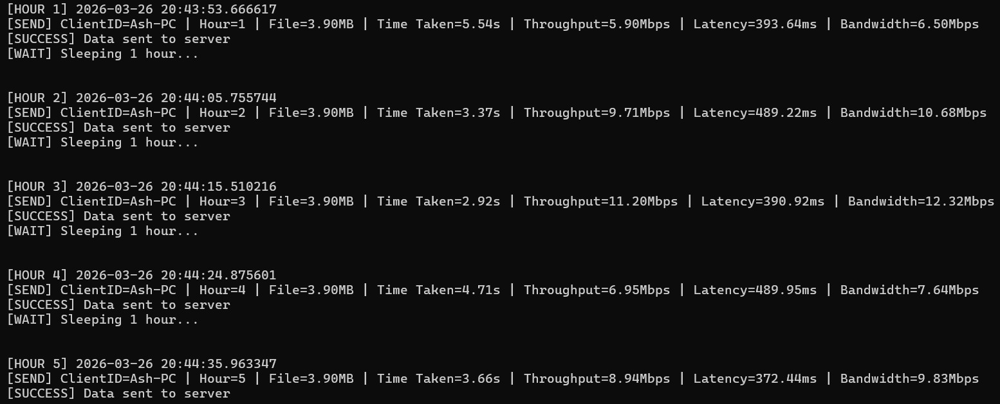
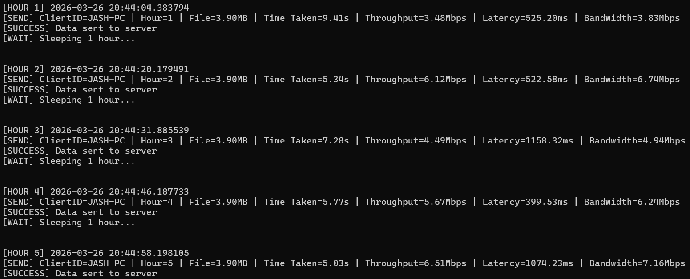
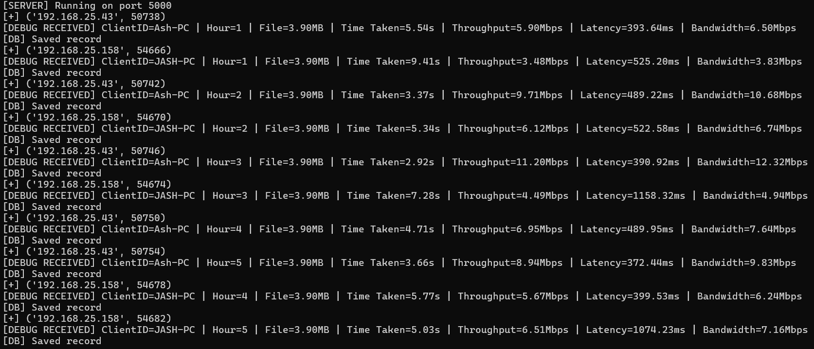
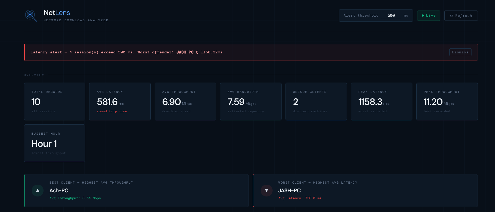
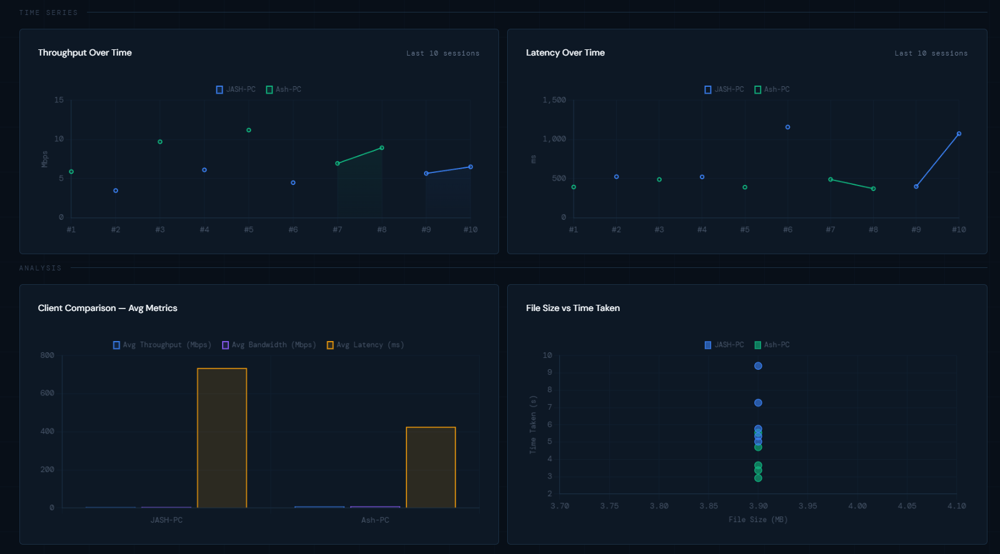
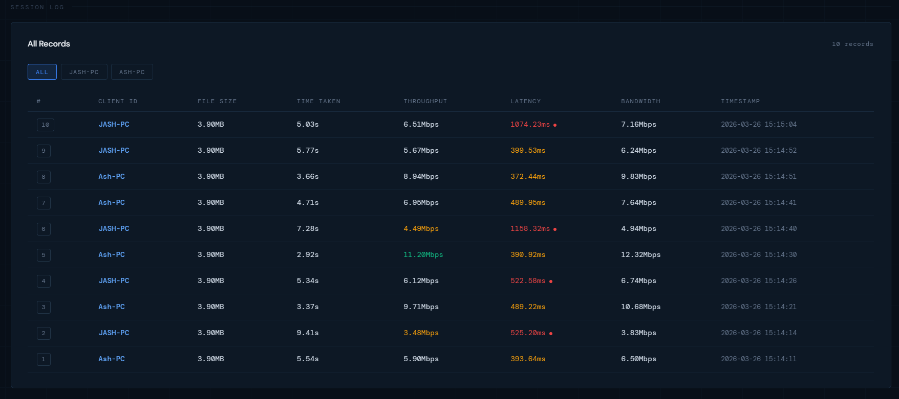

#  NetLens – Automated Network Download Analyzer

A distributed, SSL-secured client-server system that monitors, analyzes, and visualizes network download performance across multiple devices in real time.

---

##  Overview

NetLens is designed to automate network performance analysis by collecting and processing download metrics such as latency, throughput, and bandwidth from multiple clients.

It simulates a real-world network monitoring system using low-level socket programming and secure communication.

---

##  Key Features

*  **Secure Communication** using SSL/TLS sockets
*  **Multi-Client Architecture** (Distributed System)
*  **Interactive Dashboard** with real-time analytics
*  **Performance Metrics Tracking**

  * Latency (ms)
  * Throughput (Mbps)
  * Bandwidth (Mbps)
  * Download Time
*  **Centralized Data Storage** using SQLite
*  **Alert System** for high latency detection
*  **Robust Handling** of timeouts and network instability

---

##  System Architecture

Client → SSL Socket → Analyzer Server → Database → Dashboard

### Components:

* **Clients**: Perform downloads and send metrics
* **Server**: Receives, processes, and stores data
* **Database**: Stores logs and performance records
* **Dashboard**: Visualizes analytics

---

##  Workflow

1. Client performs download
2. Measures network metrics
3. Sends data securely to server
4. Server processes and stores data
5. Dashboard displays insights

---

##  Screenshots

###  Client Execution

### Client 1


### Client 2


### Server Logs



### Dashboard





---

## ⚙️ Setup Instructions

### 1️ Install dependencies

```bash
pip install -r requirements.txt
```

### 2️ Run Server

```bash
cd server
python server.py
```

### 3️ Run Client(s)

```bash
cd client
python client.py
```

### 4️ Run Dashboard

```bash
cd dashboard
python dashboard.py
```

---

##  Performance Evaluation

The system evaluates network performance using:

* Download Speed
* Throughput
* Latency
* Bandwidth Utilization

It supports analysis under:

* Multiple concurrent clients
* Variable network conditions
* Real-time data aggregation

---

##  Deployment Note

This project is designed for **LAN-based environments**.

Due to network restrictions:

* Public WiFi may block device communication
* Hotspots may cause instability

Recommended:

* Same local network
* OR tunneling tools (e.g., ngrok)

---

##  Challenges & Learnings

* Handling SSL handshake delays
* Managing unstable network conditions
* Debugging socket-level errors
* Designing multi-client concurrent systems

---

##  Tech Stack

* Python (Socket Programming, SSL)
* SQLite (Database)
* Flask (Dashboard)
* HTML/CSS/JS (Visualization)

---

##  Conclusion

NetLens demonstrates a complete end-to-end network monitoring system using low-level socket programming, secure communication, and real-time analytics.

It bridges theoretical networking concepts with practical implementation.

---
## License

[MIT](./LICENSE)

---

### Built by
[Jashruth K A](https://github.com/jashruth-k-a)
[Jai Jaswanth](https://github.com/AnakinSkywalker-0)
[Krati Patel](https://github.com/kratipatel)

---

##  Contributions

This project was developed collaboratively as part of the Computer Networks course, focusing on practical implementation of socket programming, secure communication, and network performance analysis.

* **Jashruth K A** – Implemented SSL-based secure communication and developed the dashboard for data visualization and analysis
* **Jai Jaswanth** – Designed and implemented the server-side logic, including connection handling and database integration
* **Krati Patel** – Worked on the client module, including data collection, testing, and performance metric generation

---

## ℹ️ Note

Due to centralized development and integration, most commits are from a single repository owner. However, the system design, implementation, and testing were carried out collaboratively.
